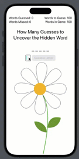

# WordGarden

WordGarden is a SwiftUI application that helps users practice spelling and word recognition through a fun and interactive word guessing game. Players guess letters to uncover hidden words, with a flower image that wilts as incorrect guesses are made.

## Features

- **Interactive Word Guessing**: Guess letters to uncover hidden words.
- **Visual Feedback**: Incorrect guesses cause the flower to wilt.
- **Sound Effects**: Correct and incorrect guesses trigger sound effects.
- **Multiple Words**: Includes a variety of words to guess from.

## Screenshots



## Requirements

- iOS 15.0+
- Xcode 13.0+
- SwiftUI

## Installation

1. Clone the repository:
  ```bash
   git clone https://github.com/dobson980/WordGarden.git
  ```

2. Open the project in Xcode:
   ```bash
   cd WordGarden
   open WordGarden.xcodeproj
   ```
## Usage

### Main View
The ContentView is the main view of the app where users can guess letters to uncover a hidden word and see visual feedback of their progress.

## Code Overview

### WordGardenApp
WordGardenApp is the entry point of the app.
```swift
import SwiftUI

@main
struct WordGardenApp: App {
    var body: some Scene {
        WindowGroup {
            ContentView()
        }
    }
}
```

### ContentView
ContentView sets up the main view with a word guessing game, visual feedback, and input fields for users to guess letters.
```swift
import SwiftUI
import AVFAudio

struct ContentView: View {
    @State private var wordsGuessed = 0
    @State private var wordsMissed = 0
    @State private var gameStatusMessage = "How Many Guesses to Uncover the Hidden Word"
    @State private var wordToGuess = ""
    @State private var revealedWord = ""
    @State private var guessedLetter = ""
    @State private var lettersGuessed = ""
    @State private var guessesRemaining = 8
    @State private var imageName = "flower8"
    @State private var playAgainHidden = true
    @State private var playAgainButtonLabel = "Another Word?"
    @State private var wordsToGuess = [""]
    @State private var audioPlayer: AVAudioPlayer?
    @FocusState private var textFieldIsFocused: Bool
    
    private let maxGuesses = 8
    
    private let wordLibrary = [
        "swift", "pizza", "taco", "apple", "chicken", "stool", "cup",
        "dog", "pants", "dirt", "sand", "car", "bike", "bicycle",
        "cat", "cow", "horse", "sheep", "goat", "bear", "elephant",
        "tiger", "giraffe", "monkey", "kangaroo", "zebra", "lion",
        "pencil", "eraser", "notebook", "backpack", "computer", "mouse",
        "keyboard", "monitor", "printer", "desk", "chair", "lamp",
        "window", "door", "wall", "floor", "ceiling", "roof",
        "garden", "tree", "flower", "grass", "bush", "river",
        "lake", "ocean", "beach", "mountain", "valley", "forest",
        "desert", "island", "volcano", "rain", "snow", "hail",
        "thunder", "lightning", "storm", "tornado", "hurricane", "earthquake",
        "sandwich", "burger", "salad", "pasta", "soup", "steak",
        "fish", "shrimp", "lobster", "crab", "octopus", "squid",
        "bread", "butter", "cheese", "milk", "egg", "yogurt", "cracker",
        "fruit", "banana", "orange", "grape", "lemon", "lime",
        "cherry", "strawberry", "blueberry", "watermelon", "melon", "peach"
    ]
    
//    private let wordLibrary = ["cat", "dog"]
    
    
    var body: some View {
        VStack {
            HStack {
                VStack(alignment: .leading) {
                    Text("Words Guessed: \(wordsGuessed)")
                    Text("Words Missed: \(wordsMissed)")
                }
                
                Spacer()
                
                VStack(alignment: .trailing) {
                    Text("Words to Guess: \(wordsToGuess.count)")
                    Text("Words in Game: \(wordLibrary.count)")
                }
            } //HStack
            .padding(.horizontal)
            
            Spacer()
            
            Text(gameStatusMessage)
                .font(.title)
                .multilineTextAlignment(.center)
                .frame(height: 80)
                .minimumScaleFactor(0.5  )
                .padding()
            
            Spacer()
            
            Text(revealedWord)
                .font(.title)
            
            if playAgainHidden {
                HStack {
                    TextField("", text: $guessedLetter)
                        .textFieldStyle(.roundedBorder)
                        .frame(width: 30)
                        .overlay {
                            RoundedRectangle(cornerRadius: 5)
                                .stroke(.gray, lineWidth: 2)
                        }
                        .keyboardType(.asciiCapable)
                        .submitLabel(.done)
                        .autocorrectionDisabled()
                        .textInputAutocapitalization(.characters)
                        .onChange(of: guessedLetter) {
                            guessedLetter = guessedLetter.trimmingCharacters(in: .letters.inverted)
                            guard let lastCharacter = guessedLetter.last else {
                                return
                            }
                            guessedLetter = String(lastCharacter).uppercased()
                        }
                        .focused($textFieldIsFocused)
                        .onSubmit {
                            guard guessedLetter != "" else {
                                return
                            }
                            guessALetter()
                            updateGamePlay()
                        }
                    
                    Button("Guess a Letter") {
                        guessALetter()
                        updateGamePlay()
                    }
                    .disabled(guessedLetter.isEmpty)
                    
                } //HStack
                .buttonStyle(.bordered)
                .tint(.mint)
                
            } else {
                
                Button(playAgainButtonLabel) {
                    if wordsToGuess.isEmpty {
                        resetGame()
                    }
                    setupNewWord()
                    playAgainHidden = true
                }
                .buttonStyle(.borderedProminent)
                .tint(.mint)
                
            }
            
            Spacer()
            
            Image(imageName)
                .resizable()
                .scaledToFit()
                .animation(.easeIn(duration: 0.75), value: imageName)
        } //VStack
        .ignoresSafeArea(edges: .bottom)
        .onAppear() {
            wordsToGuess = wordLibrary
            setupNewWord()
            playAgainHidden = true
        }
    } //Body
    func guessALetter() {
        textFieldIsFocused = false
        lettersGuessed += guessedLetter
        print("Letters Guessed: \(lettersGuessed)")
        
        revealedWord = ""
        
        for letter in wordToGuess.uppercased() {
            if lettersGuessed.contains(letter) {
                print("\(letter) is in the word")
                revealedWord += "\(letter)"
                print("revealed word: \(revealedWord)")
            } else {
                print("\(letter) is not in the word")
                revealedWord += "_ "
                print("revealed word: \(revealedWord)")
            }
        }
    }
    
    func updateGamePlay() {
        let numberOfGuesses = lettersGuessed.count
        
        if !wordToGuess.uppercased().contains(guessedLetter) {
            guessesRemaining -= 1
            imageName = "wilt\(guessesRemaining)"
            playSound(soundName: "incorrect")
            DispatchQueue.main.asyncAfter(deadline: .now() + 0.75) {
                imageName = "flower\(guessesRemaining)"
            }
        } else {
            playSound(soundName: "correct")
        }
        
        if !revealedWord.contains("_") {
            gameStatusMessage = "You won! It took you \(numberOfGuesses) guess\(numberOfGuesses == 1 ? "_" : "es") to guess the word."
            wordsGuessed += 1
            wordsToGuess.removeAll { $0 == wordToGuess }
            playAgainHidden = false
            playSound(soundName: "word-guessed")
        } else if guessesRemaining == 0 {
            gameStatusMessage = "You lost! Better luck next time!"
            wordsMissed += 1
            wordsToGuess.removeAll { $0 == wordToGuess }
            playAgainHidden = false
            playSound(soundName: "word-not-guessed")
        } else {
            gameStatusMessage = "You've made \(numberOfGuesses) guess\(numberOfGuesses == 1 ? "" : "es")"
        }
        
        if wordsToGuess.isEmpty {
            playAgainButtonLabel = "Restart Game?"
            gameStatusMessage = "You've tried all of the words. Care to start again?"
        }
        
        guessedLetter = ""
    }
    
    func setupNewWord() {
        guard let word = wordsToGuess.randomElement() else {
            print("error: no words to guess")
            return
        }
        wordToGuess = word
        print("wordToGuess: \(wordToGuess)")
        
        revealedWord = "_" + String(repeating: " _", count: wordToGuess.count - 1)
        guessesRemaining = maxGuesses
        lettersGuessed = ""
        gameStatusMessage = "How Many Guesses to Uncover the Hidden Word"
        imageName = "flower\(guessesRemaining)"
    }
    
    func resetGame() {
            wordsGuessed = 0
            wordsMissed = 0
            wordsToGuess = wordLibrary
            playAgainButtonLabel = "Another Word"
    }
    
    func playSound(soundName: String) {
        guard let soundFile = NSDataAsset(name: soundName) else {
            print("Could not read file named: \(soundName)")
            return
        }
        do {
            audioPlayer = try AVAudioPlayer(data: soundFile.data)
            audioPlayer?.play()
        } catch {
            print("ERROR: \(error.localizedDescription) creating audioPlayer")
        }
    }
    
} //ContentView

#Preview {
    ContentView()
}
```

## License

This project is licensed under the MIT License. See the [LICENSE](LICENSE) file for details.


